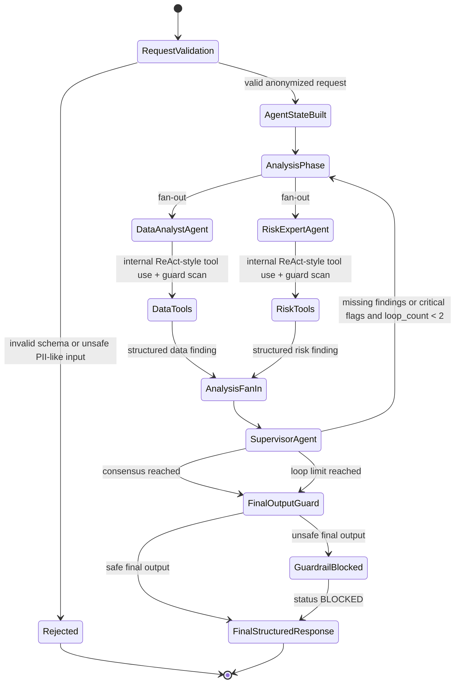

# RCT-15 Implementation Summary

**Epic:** RCT-13 - Deliver guarded, observable, multi-agent RWA executive commentary  
**Story:** RCT-14 - Implement optimized guarded multi-agent RWA executive commentary workflow  
**Task:** RCT-15 - Define optimized RWA commentary architecture, contracts, AgentState, and request validation  
**Implementation Date:** 2026-05-16

## Delivered Foundation

The RWA executive commentary foundation is implemented under `apps/backend/src/rwa_agents`
and exposed through:

```text
POST /v1/agents/rwa-analysis/run
```

Implemented backend layers:

- Pydantic v2 request/response contracts.
- Strongly typed `AgentState`.
- Pre-graph PII-like key and value rejection.
- Anonymized identifier validation.
- Compact workflow runtime with AnalysisPhase worker fan-out/fan-in.
- Parallel DataAnalystAgent and RiskExpertAgent worker execution.
- Deterministic Python tools for data-quality checks and RWA validation.
- LLM Guard-style boundary scans for request, prompts, worker outputs, supervisor input,
  and final output.
- FinalOutputGuard scan before API response.
- Optional Langfuse metadata through the prompt registry feature flag.
- Local prompt fallback.
- MemorySaver-compatible checkpointing by `thread_id`.
- Structured final commentary contract and API response.

Implemented frontend layers:

- React/TypeScript AI Executive Commentary card in the RWA Intelligence Briefing page.
- Request mapping from real briefing movement-driver data into anonymized RWA analysis records.
- Automatic generation plus Regenerate action.
- Executive Summary, CRO View, and CFO View tabs.
- Structured recommended actions, generated timestamp, source label, status, and observability
  metadata.
- Loading, empty, blocked, and error states.

## Optimized Architecture



Compact runtime:

```text
Request Validation / PII Guard
  -> AgentState Build
  -> AnalysisPhase
       -> DataAnalystAgent
       -> RiskExpertAgent
  -> AnalysisFanIn
  -> SupervisorAgent
  -> FinalOutputGuard
  -> FinalStructuredResponse
```

The previous linear design was:

```text
DataAnalystAgent -> RiskExpertAgent -> SupervisorAgent -> repeat
```

ReAct behavior stays inside worker nodes. DataAnalystAgent and RiskExpertAgent use
deterministic tools internally and emit structured findings. SupervisorAgent is the routing
and synthesis step after fan-in.

## Key Files

Backend:

- `apps/backend/src/rwa_agents/schemas.py`
- `apps/backend/src/rwa_agents/state.py`
- `apps/backend/src/rwa_agents/validation.py`
- `apps/backend/src/rwa_agents/tools.py`
- `apps/backend/src/rwa_agents/workflow.py`
- `apps/backend/src/rwa_agents/api.py`
- `apps/backend/tests/agents/`

Frontend:

- `apps/frontend/src/components/rwa-briefing/AiExecutiveCommentaryCard.tsx`
- `apps/frontend/src/api/types.ts`
- `apps/frontend/src/api/rwaApi.ts`
- `apps/frontend/src/pages/RwaIntelligenceBriefingPage.tsx`

Docs:

- `docs/agents/architecture.md`
- `docs/agents/contracts.md`
- `docs/agents/validation.md`

## Verification

The implementation includes tests for:

- Valid anonymized request to AgentState.
- Default loop limit of 2.
- PII-like field and value rejection before graph execution.
- Allowed anonymized identifiers.
- Structured API response shape.
- Final-output guardrail blocking.
- MemorySaver-compatible checkpointing.
- Frontend AI commentary controls in Playwright navigation flow.

