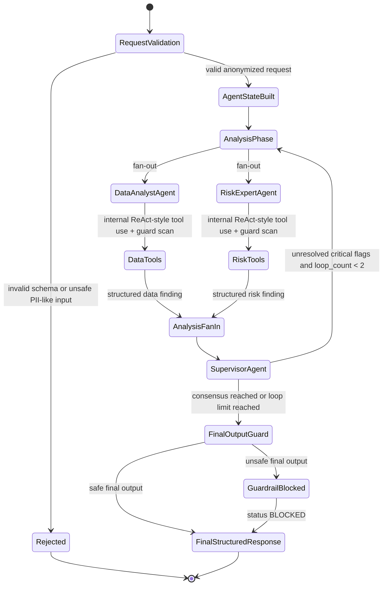

# RWA Executive Commentary Architecture

The RWA executive commentary workflow is implemented under `apps/backend/src/rwa_agents`
and exposed through `POST /v1/agents/rwa-analysis/run`.



The previous shape was a linear loop:

```text
DataAnalystAgent -> RiskExpertAgent -> SupervisorAgent -> repeat
```

The optimized implementation keeps the graph compact:

```text
Request Validation / PII Guard
  -> AgentState Build
  -> AnalysisPhase
       -> DataAnalystAgent
       -> RiskExpertAgent
  -> AnalysisFanIn
  -> SupervisorAgent
  -> FinalOutputGuard
  -> FinalStructuredResponse
```

ReAct behavior stays inside worker nodes. Each worker selects and executes deterministic
Python tools internally, then emits structured findings. The worker fan-out is run in
parallel because both workers depend only on the initial anonymized AgentState.

Cross-cutting production layers:

- LLM Guard boundary adapter scans request, prompt inputs, worker outputs, supervisor input,
  and complete final commentary before response.
- Prompt Registry resolves agent prompts through a local fallback, with Langfuse metadata
  enabled when `RWA_LANGFUSE_ENABLED=true`.
- Observability returns node transitions, tool calls, prompt usage, guardrail events, scores,
  and trace metadata.
- MemorySaver-compatible checkpointing stores AgentState by stable `thread_id`/`request_id`.

