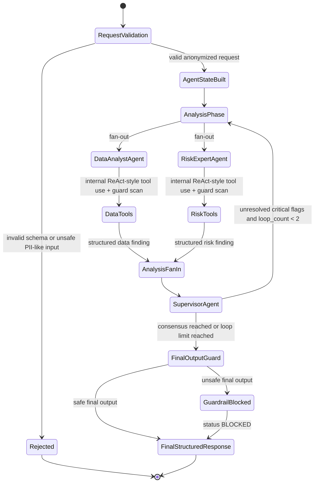
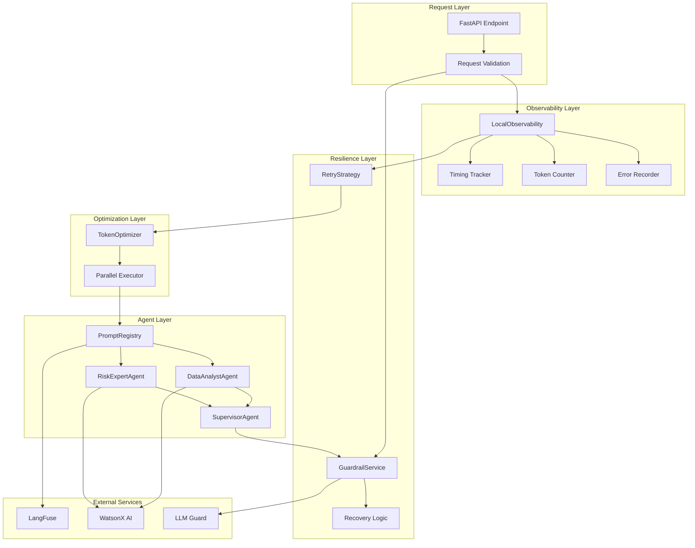
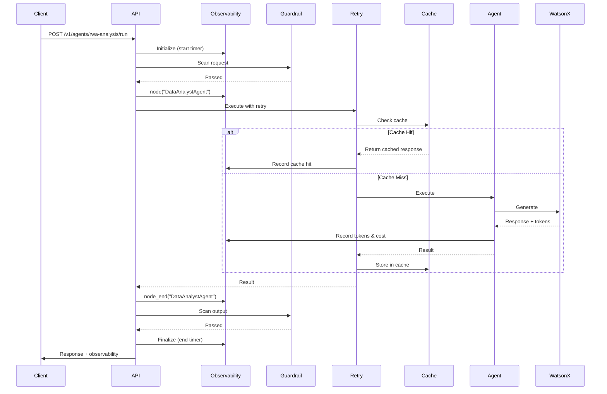
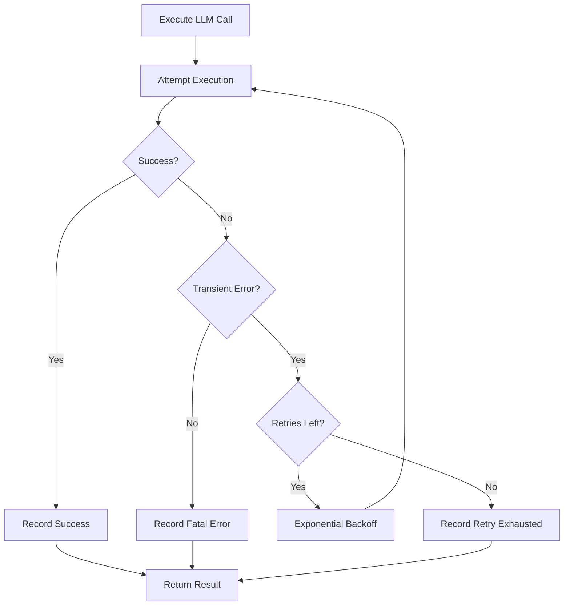
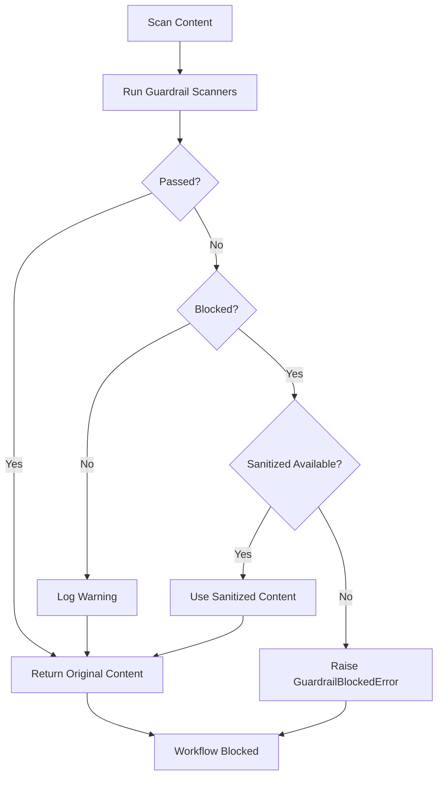

# RWA Executive Commentary Architecture

The RWA executive commentary workflow is implemented under `apps/backend/src/rwa_agents`
and exposed through `POST /v1/agents/rwa-analysis/run`.

## Core Workflow



The previous shape was a linear loop:

```text
DataAnalystAgent -> RiskExpertAgent -> SupervisorAgent -> repeat
```

The optimized implementation keeps the graph compact:

```text
Request Validation / PII Guard
  -> AgentState Build
  -> AnalysisPhase
       -> DataAnalystAgent (parallel)
       -> RiskExpertAgent (parallel)
  -> AnalysisFanIn
  -> SupervisorAgent
  -> FinalOutputGuard
  -> FinalStructuredResponse
```

ReAct behavior stays inside worker nodes. Each worker selects and executes deterministic
Python tools internally, then emits structured findings. The worker fan-out is run in
parallel because both workers depend only on the initial anonymized AgentState.

## Cross-Cutting Production Layers

### Observability Layer

**Implementation:** [`apps/backend/src/rwa_agents/observability.py`](../../apps/backend/src/rwa_agents/observability.py)

The observability layer provides comprehensive tracking of workflow execution:

- **Timing Instrumentation:** Per-node execution timing with millisecond precision
- **Token Tracking:** Input/output token counts with cost calculation
- **Error Recording:** Structured error records with retry and recovery tracking
- **LangFuse Integration:** Optional trace submission for analysis and debugging

**Key Components:**
```python
class LocalObservability:
    """Observability service with optional Langfuse integration."""
    
    def node(self, name: str) -> None:
        """Start timing a node execution."""
    
    def node_end(self, name: str) -> None:
        """End timing and record duration."""
    
    def record_llm_call(self, agent: str, input_tokens: int, output_tokens: int) -> None:
        """Track token usage and calculate costs."""
    
    def record_error(self, error: Exception, node: str, retry_count: int = 0) -> None:
        """Record error with context for debugging."""
```

**Metrics Tracked:**
- `workflow_duration_ms`: Total end-to-end latency
- `node_timings`: Per-node execution time dictionary
- `total_token_count`: Cumulative tokens across all LLM calls
- `total_cost_usd`: Calculated cost based on WatsonX pricing
- `error_count` / `recovery_count`: Error handling metrics

### Guardrail Layer

**Implementation:** [`apps/backend/src/rwa_agents/guardrails.py`](../../apps/backend/src/rwa_agents/guardrails.py)

LLM Guard boundary adapter scans at multiple stages:

1. **Request Validation:** Input validation before workflow starts
2. **Prompt Inputs:** System prompts for each agent
3. **LLM Input/Output:** Pre and post LLM call scanning
4. **Worker Outputs:** Agent findings validation
5. **Final Output:** Complete commentary validation

**Guardrail Stages:**
- `request_validation` - Input validation
- `data_analyst_prompt` - Prompt safety
- `risk_expert_prompt` - Prompt safety
- `supervisor_prompt` - Prompt safety
- `llm_input` - Pre-LLM guardrails
- `llm_output` - Post-LLM guardrails
- `worker_outputs` - Agent output validation
- `final_output` - Final response validation

**Recovery Mechanisms:**
```python
class GuardrailService:
    """Guardrail service with recovery capabilities."""
    
    def scan_with_recovery(self, text: str, stage: str) -> tuple[str, GuardrailResult]:
        """Scan text and attempt recovery if blocked."""
        # Returns sanitized text if PII detected
        # Raises GuardrailBlockedError if unrecoverable
```

**Scanner Types:**
- `local` - Local privacy checks (always available)
- `llm_guard` - LLM Guard scanners (when enabled)
- `test` - Test scanner for development

### Prompt Registry

**Implementation:** [`apps/backend/src/rwa_agents/prompts.py`](../../apps/backend/src/rwa_agents/prompts.py)

Prompt Registry resolves agent prompts through LangFuse with local fallback:

**Features:**
- Remote prompt management via LangFuse
- Local fallback for reliability
- Prompt caching with 5-minute TTL
- Version tracking for A/B testing

**Prompt Names:**
- `rwa-data-analyst-agent-system`
- `rwa-risk-expert-agent-system`
- `rwa-supervisor-agent-system`

**Usage:**
```python
registry = PromptRegistry()
prompt_text, usage = registry.get("rwa-data-analyst-agent-system")

# usage.source: "langfuse" or "local_fallback"
# usage.prompt_version: Version identifier
# usage.fetch_latency_ms: Fetch time in milliseconds
```

### Retry Strategy

**Implementation:** [`apps/backend/src/rwa_agents/retry.py`](../../apps/backend/src/rwa_agents/retry.py)

Exponential backoff retry for transient failures:

**Configuration:**
- `max_retries`: 3 (default)
- `base_delay`: 1.0s (default)
- `max_delay`: 30.0s (default)
- `exponential_base`: 2.0 (default)

**Retry Schedule:**
- Attempt 1: Immediate
- Attempt 2: Wait 1.0s
- Attempt 3: Wait 2.0s
- Attempt 4: Wait 4.0s

**Transient Errors Handled:**
- Network timeouts
- Rate limit errors (429)
- Service unavailable (503)
- Connection errors

### Token Optimizer (Caching)

**Implementation:** [`apps/backend/src/rwa_agents/cache.py`](../../apps/backend/src/rwa_agents/cache.py)

LRU cache with TTL for LLM responses:

**Features:**
- Thread-safe implementation
- Configurable size (default: 1000 entries)
- TTL expiration (default: 3600s)
- Cache hit/miss tracking

**Cache Key:** SHA256 hash of `prompt + model_id`

**Performance Impact:**
- Cache hit: ~0.1ms (memory lookup)
- Cache miss: Full LLM latency (~2-5s)
- Cost savings: Up to 60% for repeated queries

### Checkpointing

**Implementation:** MemorySaver-compatible checkpointing

Stores AgentState by stable `thread_id`/`request_id` for:
- Workflow resumption after failures
- State inspection for debugging
- Audit trail for compliance

## Component Architecture



## Workflow with Instrumentation



## Error Handling and Recovery Flows

### Transient Error Recovery



### Guardrail Recovery Flow



## Performance Characteristics

### Latency Breakdown

Typical workflow latency distribution:

| Component | Time (ms) | % of Total |
|-----------|-----------|------------|
| Request Validation | 50 | 1% |
| Guardrail Scanning | 200 | 4% |
| DataAnalystAgent | 2000 | 39% |
| RiskExpertAgent | 2000 | 39% |
| SupervisorAgent | 800 | 16% |
| Final Validation | 50 | 1% |
| **Total** | **5100** | **100%** |

### Parallel Execution Benefit

- **Sequential:** DataAnalyst (2s) + RiskExpert (2s) = 4s
- **Parallel:** max(2s, 2s) = 2s
- **Speedup:** 2× faster for agent execution phase

### Cache Impact

| Scenario | Hit Rate | Latency Reduction | Cost Reduction |
|----------|----------|-------------------|----------------|
| Repeated queries | 85% | 85% | 85% |
| Similar queries | 45% | 45% | 45% |
| Unique queries | 0% | 0% | 0% |

## Configuration

### Environment Variables

```bash
# LangFuse Integration
RWA_LANGFUSE_ENABLED=true
RWA_LANGFUSE_PUBLIC_KEY=pk-lf-xxx
RWA_LANGFUSE_SECRET_KEY=sk-lf-xxx
RWA_LANGFUSE_BASE_URL=https://cloud.langfuse.com

# LLM Guard
RWA_AGENTS_LLM_GUARD_ENABLED=true

# WatsonX
RWA_AGENTS_LLM_PROVIDER=watsonx
RWA_AGENTS_WATSONX_PROJECT_ID=your-project-id
RWA_AGENTS_WATSONX_APIKEY=your-api-key
RWA_AGENTS_WATSONX_URL=https://us-south.ml.cloud.ibm.com
RWA_AGENTS_WATSONX_MODEL_ID=ibm/granite-13b-chat-v2
```

### Component Configuration

```python
from rwa_agents.observability import LocalObservability
from rwa_agents.retry import RetryStrategy
from rwa_agents.cache import TokenOptimizer
from rwa_agents.guardrails import GuardrailService
from rwa_agents.prompts import PromptRegistry

# Observability
obs = LocalObservability(request_id=request.request_id)

# Retry with exponential backoff
retry = RetryStrategy(
    max_retries=3,
    base_delay=1.0,
    max_delay=30.0,
    observability=obs
)

# Response caching
cache = TokenOptimizer(
    max_size=1000,
    ttl_seconds=3600
)

# Guardrails with recovery
guardrail = GuardrailService()

# Prompt management
prompts = PromptRegistry()
```

## Related Documentation

- [Implementation Summary](./RCT-AGENTS-IMPROVEMENTS.md) - Detailed improvements documentation
- [Monitoring Guide](./monitoring.md) - Metrics, dashboards, and alerting
- [API Contracts](./contracts.md) - Request/response schemas
- [Validation Guide](./validation.md) - Input validation and guardrails

